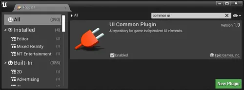

# ProjectCommonUI - UE5.6 Starter Project
This is a starter project template for building user interfaces and menus using the Common UI framework in Unreal Engine 5.6. Created by Broken Gameplay Studios, it provides basic setups, examples, and reusable assets to help developers get started with cross-platform UI elements, navigation, and input handling. The project is designed to be modular and extensible, but it's a work in progress—expect ongoing updates and potential bugs as we refine it.

## Requirements

- Unreal Engine 5.6 (or compatible versions; tested on 5.6).
- Common UI plugin: This must be enabled in your project settings (Edit > Plugins > Search for "Common UI" > Enable and restart the editor).
- If migrating assets to another project, ensure the Common UI plugin is enabled there first to avoid errors with widgets, blueprints, or input bindings.

## Getting Started

- Clone this repository to your local machine.
- Open the .uproject file in Unreal Engine 5.6 (right-click > Open with Unreal Engine if needed).
- The project includes:
    - Basic Common UI widgets and blueprints for menus, buttons, and tabs.
    - Example maps and game modes demonstrating UI flows.
    - Input configurations for keyboard/mouse and gamepad support.
- Build and play in the editor to test the starter menus.

## Migration to Other Projects

- Copy the desired assets (e.g., from /Content/UI/) to your target project.
- Enable the Common UI plugin in the target project's settings before importing or using the assets.
- Rebuild any blueprints or widgets if dependencies are missing.
- Note: Some assets may require manual reconnection of inputs or styles due to project-specific setups.

## Known Issues and Updates

- This project is actively being developed, so updates may introduce new features, fixes, or occasional bugs. Check the commit history or issues tab for details.
- Common bugs might include navigation glitches on certain input devices or styling inconsistencies across platforms—report them via Discord or GitHub issues.
- We recommend pulling the latest changes regularly and testing in your environment.

## Community and Support
Join the Broken Gameplay Studios Discord for discussions, feedback, or help with this project: [https://discord.gg/JEKCW9h](https://discord.gg/JEKCW9h).