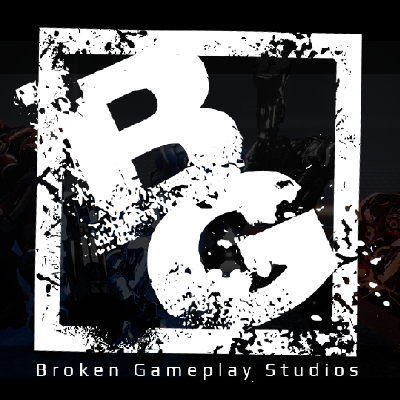

# ProjectCommonUI
A public starter project and documentation for building menus with Common UI in Unreal Engine, created by Broken Gameplay Studios. Includes templates, examples, and guides to help developers.



# Setup Guide

## Obsidian Vault / Unreal Engine

This guide covers everything needed to set up the ProjectCommonUI repository on a new computer, including installing Obsidian, Git, cloning the repo, configuring the Obsidian Git plugin for automatic syncing, and working with the Unreal Engine 5.6 project inside it. It's designed for collaborators (like your friends) to get up and running quickly. The repo is public, so anyone can fork or contribute, but for discussions or coordinated changes, join the Broken Gameplay Studios Discord (invite: [https://discord.gg/JEKCW9h](https://discord.gg/JEKCW9h)).

The repo structure includes:

- `/Docs/`: Obsidian Markdown notes for documentation.
- `/Docs/attachments/`: Images and attachments for docs (use relative paths for cross-compatibility).
- `/CommonUIProject_UE5_6/`: The UE5.6 starter project folder with Common UI assets.
- Root files: README.md, LICENSE, .gitignore.

## Prerequisites

- Windows 11 (instructions are Windows-focused; adapt for other OS).
- GitHub account (for cloning and contributing).
- Unreal Engine 5.6 installed (free from Epic Games Launcher) if working with the UE project.

## Step 1: Install Obsidian

- Download Obsidian from [https://obsidian.md/download](https://obsidian.md/download) (free, no account needed).
- Run the installer and follow prompts (default settings are fine).
- Launch Obsidian—it's a local app that treats folders as "vaults" for notes.

## Step 2: Install and Configure Git

Git is required for cloning and syncing the repo. These steps are for Windows 11 using PowerShell (open via Start > Search "PowerShell").

1. Install Git:
    - Open PowerShell as Administrator (right-click Start > Terminal (Admin) > PowerShell tab).
    - Run:
        
        ```text
        winget install --id Git.Git -e --source winget
        ```
        
    - Close and reopen PowerShell (non-admin).
    - Verify: `git --version` (should show version like 2.45.x).    
2. Basic Configuration:
(Contributer Only)
    - Set your username and email (use your GitHub details):
        
        ```text
        git config --global user.name "Your Full Name"
        ```
        ```text
        git config --global user.email "your.email@example.com"
        ```
        
    - Verify: `git config --list.`
3. Set Up SSH for GitHub (secure, no passwords for pushes/pulls):
(Contributer Only)
    - Generate key: `ssh-keygen -t ed25519 -C "your.email@example.com"` (Enter for defaults; optional passphrase).
    - Start agent:
        
        ```text
        Get-Service ssh-agent | Set-Service -StartupType Automatic
        Start-Service ssh-agent
        ssh-add $HOME\.ssh\id_ed25519
        ```
        
    - Copy public key: `Get-Content $HOME\.ssh\id_ed25519.pub | Set-Clipboard`.
    - Add to GitHub: Settings > SSH and GPG keys > New SSH key > Paste and save.
    - Test: `ssh -T git@github.com (should say "Hi username!")`.

If SSH fails, use HTTPS with a Personal Access Token (GitHub > Settings > Developer settings > Personal access tokens > Generate new > repo scope).

## Step 3: Clone the Repository

- Create a local folder (e.g., F:\Git\ProjectCommonUI): mkdir F:\Git\ProjectCommonUI.
- Clone:

    (Contributer Only)    
    ```text    
    git clone git@github.com:BrokenGameplayStudios/ProjectCommonUI.git ProjectCommonUI
    ```
    
    (Non-Contributer / Download Only)
    ```text
    git clone https://github.com/BrokenGameplayStudios/ProjectCommonUI.git
    ```
    
- Navigate: `cd ProjectCommonUI`.
- Verify: `git status` (should be clean).

## Step 4: Open as Obsidian Vault
(Contributer Only)

- In Obsidian: File > Open folder as vault > Select `F:\Git\ProjectCommonUI` (replace with your destination).
- Obsidian will load the root as the vault, showing Markdown files in /Docs/ and README.md.

## Step 5: Install and Configure Obsidian Git Plugin
(Contributer Only)

- In Obsidian: Settings > Community plugins > Turn off safe mode > Browse > Search "Git" > Install > Enable.
- Settings > Git (plugin):
    - Authentication: Use SSH (from Step 2) or enter PAT for HTTPS.
    - Auto-pull on startup: Enable.
    - Auto-pull interval: 5-10 minutes.
    - Auto commit interval: 10-15 minutes.
    - Auto push after auto commit: Enable.
    - Commit message: "vault backup: {{date:YYYY-MM-DD HH:mm}}".
- Test: Command Palette (Ctrl+P) > "Git: Pull" to fetch latest.

This automates syncing—pulls keep you updated, pushes share changes.

## Step 6: Working with the UE5.6 Project

- Open `/CommonUIProject_UE5_6/CommonUI.uproject` in Unreal Engine 5.6.
- Enable Common UI plugin: Edit > Plugins > Search "Common UI" > Enable > Restart.
- Build and test the project (includes menus, inputs, etc.).
- If migrating assets: Copy from /Content/ to your project, ensure Common UI is enabled there.
- Avoid committing temp files—.gitignore handles this.

## Contributing

- Fork the repo on GitHub and submit pull requests for changes.
- For discussions, bugs, or coordination: Join Broken Gameplay Studios Discord at [https://discord.gg/JEKCW9h](https://discord.gg/JEKCW9h).
- Communicate before major edits to avoid conflicts (e.g., who's working on what).
- The project will evolve—report issues on GitHub or Discord.

This setup is self-contained for any computer. If issues arise (e.g., auth errors), check Discord or GitHub issues. Happy collaborating!


